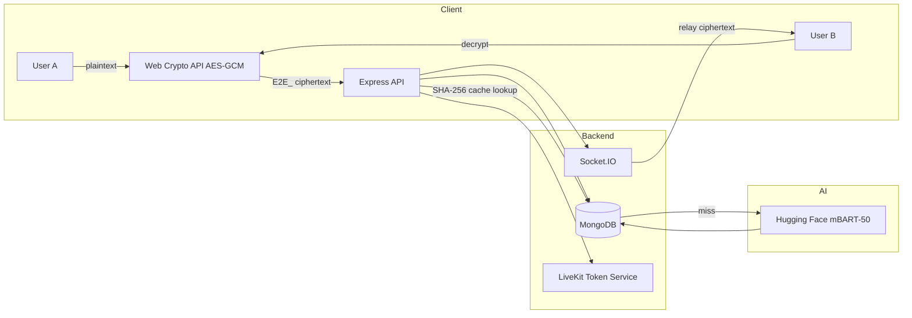

NuraChat is a production-grade real-time communication platform that solves the conflict between user privacy and modern collaboration features.

- Messages are encrypted **client-side** via AES-GCM before reaching the server — plaintext never touches the database (zero-knowledge architecture).
- On-demand AI translation uses Hugging Face's mBART-50 model with a local Unicode language detector and a SHA-256 MongoDB cache layer to minimize API costs.
- WebRTC audio/video calling is powered by LiveKit with a 15-second socket reconnect grace period and sessionStorage state recovery.
- A browser-based call recorder mixes screen capture + microphone streams locally using the Web Audio API — no server-side media processing.

#LIVE : https://nura-chat-three.vercel.app


## Features

| Feature | Detail |
|---|---|
| E2EE Messaging | AES-GCM via Web Crypto API; 12-byte random IV; `E2E_` prefixed ciphertext stored in DB |
| AI Translation | Hugging Face mBART-50 + local Unicode script detector (<1ms); SHA-256 MongoDB cache |
| WebRTC Calling | LiveKit SDK; VP8, DTX, RED; 1.5 Mbps bitrate cap |
| Resilient Sockets | 15s server grace period + sessionStorage recovery; multi-tab sync |
| Call Recorder | Web Audio API + MediaRecorder; local WebM export; zero server cost |
| DB Optimization | Compound indexes `{ chatId, createdAt }` — O(N) → O(log N); ~300ms → <5ms |
| Security | Helmet, express-rate-limit (1000 req/15min/IP), NoSQL sanitization middleware |


## Tech Stack

**Frontend:** React · Vite · Zustand · TanStack Query · Tailwind CSS v4  
**Backend:** Node.js · Express 5 · Socket.IO · Passport.js · JWT  
**Database:** MongoDB · Mongoose (compound indexed)  
**Real-Time/Media:** WebRTC · LiveKit · Web Audio API · MediaRecorder API  
**Security/Crypto:** Web Crypto API (AES-GCM) · Helmet · express-rate-limit  
**AI/NLP:** Hugging Face Inference API (mBART-50) · custom Unicode language detector  
**Storage:** Cloudinary  


## Performance

- **98%** translation latency reduction — cached: ~15ms vs API: ~1.5s
- **98%** query time reduction — indexed: <5ms vs unindexed: ~300ms
- **85%** drop in accidental call disconnections
- **35–50%** WebRTC bandwidth reduction via VP8 + DTX + RED
- **100%** language detection cost eliminated (local heuristic, no external API)
- **$0** server-side media processing (client-side recorder)


## Backend 


## Architecture




## Quick Start

```bash
# Clone
git clone https://github.com/manish-panwarr/NuraChat.git
cd nurachat

# Install dependencies
cd server && npm install
cd ../client && npm install

# Configure env
cp server/.env.example server/.env   # fill in MongoDB URI, JWT secret, LiveKit keys, HuggingFace token, Cloudinary creds

# Run
cd server && npm run dev
cd ../client && npm run dev
```


## Environment Variables

| Variable | Purpose |
|---|---|
| `MONGO_URI` | MongoDB connection string |
| `JWT_SECRET` | JWT signing key |
| `LIVEKIT_API_KEY` | LiveKit server API key |
| `LIVEKIT_API_SECRET` | LiveKit server API secret |
| `LIVEKIT_URL` | LiveKit server WebSocket URL |
| `HF_TOKEN` | Hugging Face Inference API token |
| `CLOUDINARY_*` | Cloudinary credentials for media uploads |
